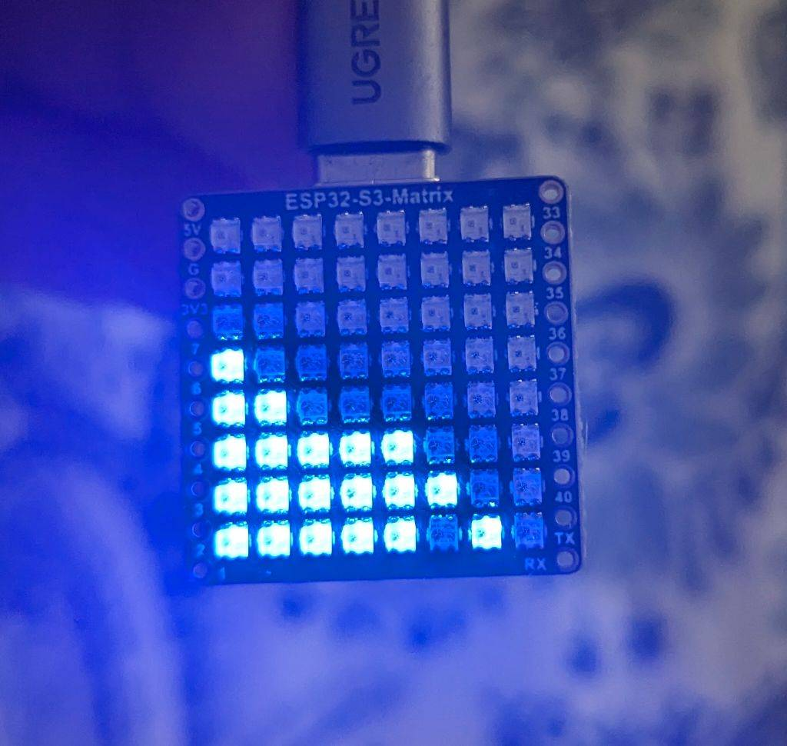

# ESP32-S3-Matrix by Waveshare fluid simulation
 port of fluid simulation for ESP32-S3-Matrix by Waveshare

# Compliations notes:
- use SensorLib 2.1 as newers verions don't compile when using QMI8658

# Backstory
I was inspired by [Fluid Simulation Pendant](https://www.youtube.com/watch?v=jis1MC5Tm8k) but I was ~~too lazy~~ under equipped to create fully custom version.

I looked on AliExpress and I found this [Waveshare ESP32-S3-Matrix](https://www.waveshare.com/wiki/ESP32-S3-Matrix).

That was perfect for testing so after getting it I was able to play with playing animations and auto rotating the "display", but fluid simulation was way over my understanding.

[Also made it battery powered and made a simple test case for it.]

OP didn't provide the code, but one day I've got great idea: someone else must have done this before!

So I borrowed the code from [ESP32 Fluid simulation on 16x16 Led Matrix](https://hackaday.io/project/202470-esp32-fluid-simulation-on-16x16-led-matrix) and managed to adapt it to hardware of Waveshare Matrix: different MPU, LED matrix pattern and size of output display (easiest change).

I'm also going to adapt the color version, looks fun.

If you just want to play with already working code check the repository.

I also put original in a backup folder, in case someone would remove it from original place.

# checkout video in action :)
